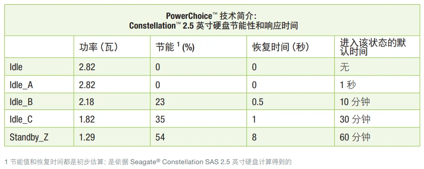

---
tags:
  - TrueNAS
  - 希捷/EXOS
  - 硬盘
  - Load_Cycle_Count
  - Load Cycle Count 
  - SeaChest_PowerControl
---


## 前言

最近给我的NAS升级了一组`Exos-X18`硬盘, 一天检查SMART的时候发现其中硬盘的`Load_Cycle_Count`已经突破了500次  
但是通电时间才不到300小时, 这很奇怪, 因为另外几个`HC550`两万小时了,`Load_Cycle_Count`次数也才不到1000次    
于是我上谷歌一顿搜索算是找到了原因所在


## Load_Cycle_Count 是什么？

`Load_Cycle_Count` 是硬盘磁头的加载/卸载循环次数, 网上查询到的信息是,厂商普遍建议这个值的上限是在`600000`左右,数值越高越影响硬盘的稳定性和性能,硬盘每次停车再加载就会让这个值增加一

希捷支持的硬盘有几种节能模式,信息如下[^1],单位都是100毫秒(挺怪的,反正我设置为1200000毫秒,显示为1200)

|  名称 |  当前时间 | 默认时间  |  保存时间  | 恢复时间 | 描述 |
| :---: | :---: | :---: | :---: | :---: |  :---: |
| Idle A |  *1  | *1  |  1  |  1  | 禁用多数伺服系统，减少处理器和通道功耗,全速 (7200RPM) 转动 |
| Idle B |  *1200   | *1200 |  1200    |  4 | 禁用多数伺服系统，减少处理器和通道功耗,磁头卸载到硬盘斜坡, 全速 (7200RPM) 转动 |
| Idle C/Standby_Y(仅 SAS) |  0  | 6000 |  6000    |  20  | 禁用多数伺服系统，减少处理器和通道功耗,硬盘速度RPM降低 |
| Standby Z |   0  | 9000 |  9000    |  110  | 磁头卸载到硬盘斜坡,硬盘马达停转,硬盘仍可对非磁碟访问主机命令作出响应 |

希捷官方描述 PowerChoice 各项节能模式指标如下




## Load_Cycle_Count 高的原因


希捷的Exos系列硬盘默认情况2分钟进入`Idle B`模式,而`TrueNAS`5分钟进行一次SAMRT温度检查。但是希捷的硬盘在检查SMART时也会唤醒[^2] (西数的不会这样)   
这就导致了一种情况, 哪怕当你没有对硬盘进行任何IO操作。每过2分钟,硬盘进入`Idle B`模式, 然后再过3分钟,`TrueNAS`检查`SMART`, 硬盘又会唤醒, 这就导致了`Load_Cycle_Count`值增加。五分钟一个循环


## 设置节能模式

使用希捷官方的工具 `SeaChest_PowerControl` 可以设置硬盘的节能模式, 工具可以从官网下载: https://www.seagate.com/cn/zh/support/software/seachest/


具体操作如下,首先扫描所有的硬盘。

```shell
./SeaChest_PowerControl --scan
```

会输出类似这样的列表: 

```shell
Vendor   Handle       Model Number            Serial Number          FwRev     
ATA      /dev/sg3     ST16000NM000J-2TW103    WRS1ACCM               SN04      
```
使用以下命令可以查看某个硬盘的EPC设置,标记为*的为已启用。C/S需要为Y才能够修改对应的设置。

```shell
./SeaChest_PowerControl -d /dev/sg3 --showEPCSettings

===EPC Settings===
	* = timer is enabled
	C column = Changeable
	S column = Savable
	All times are in 100 milliseconds

Name       Current Timer Default Timer Saved Timer   Recovery Time C S
Idle A     *1            *1            *1            1             Y Y
Idle B     *1200         *1200         *1200         4             Y Y
Idle C      0             6000          6000         20            Y Y
Standby Z   0             9000          9000         110           Y Y

```


使用以下命令即可修改或者禁用对应的节能模式

```shell
./SeaChest_PowerControl -d /dev/sg<#>  [--idle_a|--idle_b|--idle_c|--standby_z]  [enable | disable | default | timerValueMilliseconds]
```


[^1]:https://www.bilibili.com/opus/847759800462737445
[^2]:https://www.reddit.com/r/truenas/comments/p1ebnf/comment/jjbjrfb/
[^3]:https://www.bilibili.com/opus/711333961215770630


