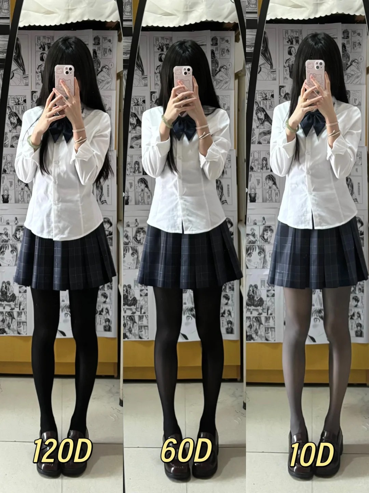
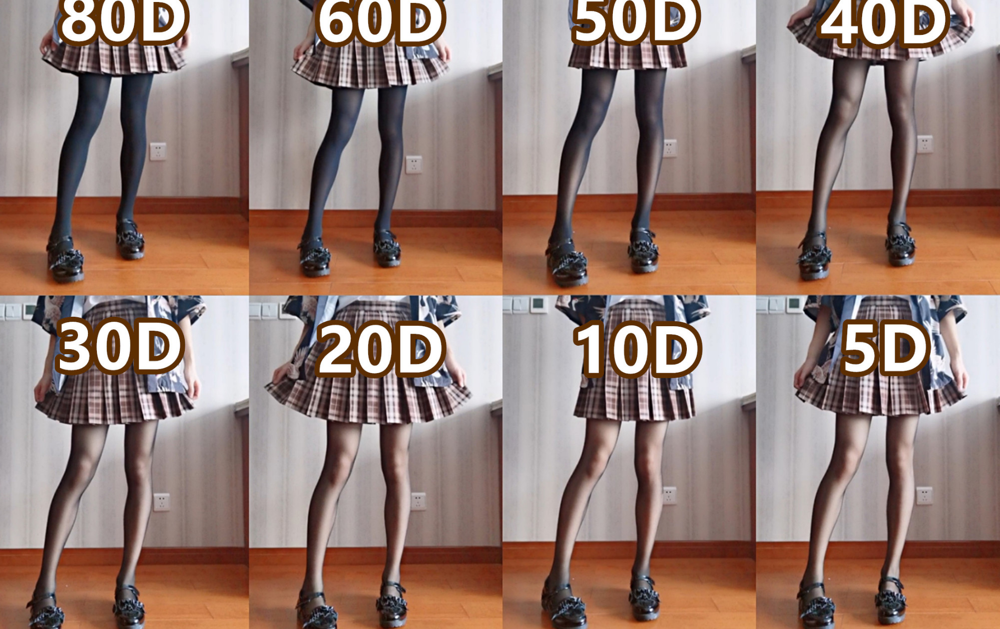
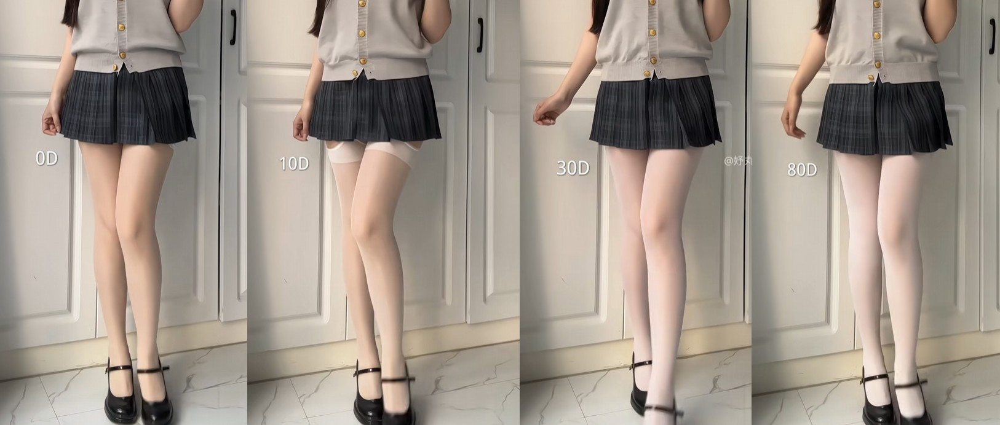
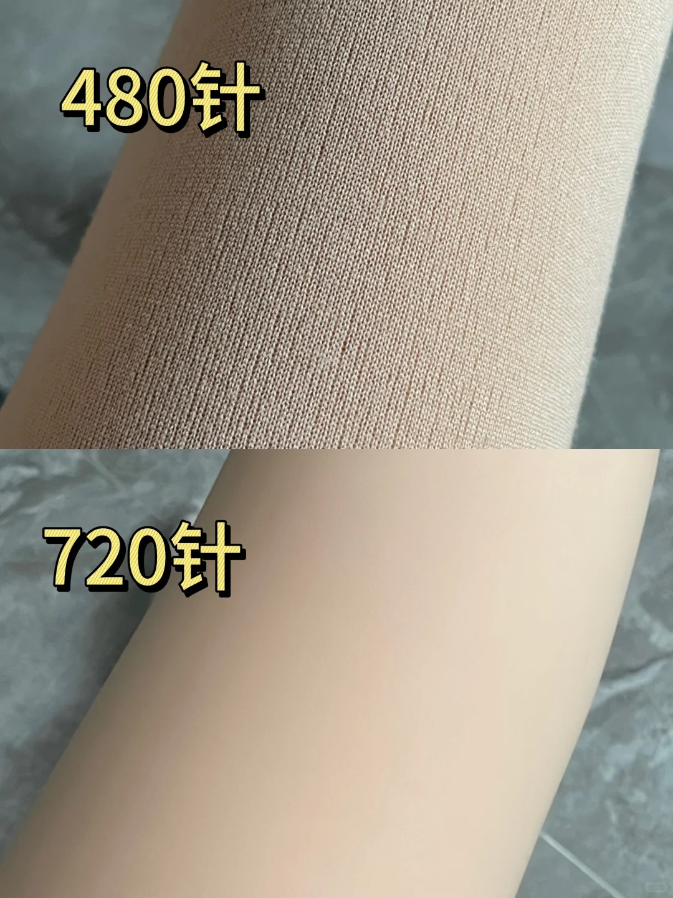

---
tags:
  - 丝袜
  - 裤袜
  - 丝袜知识库
---

## 知识库

了解不同工艺之间的区别。方便自己选择合适的材质，厚度，线数，款式等。

### 材质

- 天鹅绒  
  - 更细跟柔软，延展性也不错，穿起来舒服。常被用来制作高档丝袜！
- 雪黛丽
  - 哑光，薄，弹性好，略贵
- 包芯丝  
  - 通常用来制作中档丝袜, 不耐穿但透肤较好
- 水晶丝
  - 最便宜的种类,使用没有延展性的尼龙丝。穿起来会有点紧绷。

> 丝袜的成分其实都一样，基本就是锦纶和氨纶组成，根据不同配比和织法形成了不同材质特性，氨纶比例越高弹性就越大。

评价 

> 天鹅绒显得臃肿 不透肤 只有春秋才穿 夏季还是包芯丝好看

### 厚度

> 首先需要科普两个单位，D和g，D一般用在丝袜上，g一般用在光腿神器上，单位前的数字越小，袜子越薄。  

> 袜子越薄,就越容易勾丝容易坏  

> 腿型不好看的话，建议可以考虑穿压力袜来修型或者穿厚一点的不那么透的来遮掩一下瑕疵  

[从lo娘角度讲讲丝袜！](https://nga.178.com/read.php?tid=34810643)

::: warning  

5D的超薄款丝袜，哪怕手上有一些干皮，也很容易把丝袜勾的面目全非……这也是很多品牌的超薄丝袜会随产品赠送手套的原因，这种超薄型的丝袜也是超级易消耗品  
基本完整的穿2-3次（完整的一天12小时生活）就会因为各种意外产生勾丝和破损，且价格一般都比厚一点的丝袜要贵。所以建议新手宝多考虑15D到40D的丝袜来作为入门[^1]。

:::

| D数 | 说明 | 适用温度 | 
| --- | --- | --- |
| 0–10D	|超薄“隐形” 款几乎透明 | 25度以上 |
| 10–20D |	轻薄自然	| 20-25度 |
| 20–40D |	透肤但略有| 20度	 |
| 40–80D |	半不透明	| 10度左右 |
| 80–120D |	不透明 | 	5度左右 |
| >120D | 加绒/加厚	|0度以下,严寒冬季  |	

::: details 丝袜厚度上腿对比

:::

::: tip 

0-5D的丝袜基本上都是超薄款了，非常适合夏天穿  
白丝如果厚度太低的情况下跟肉丝区别甚小(30D及以下)

:::

### 款式

> 网袜、吊带、花纹、连裤袜、全身袜；  
> 其中连裤袜有开档、t档、无缝档等..  
> 我感觉无缝档的出现是丝袜选择的一个分水岭，无缝档带来的全包裹感使得丝袜的体验上升了一个台阶，真是伟大的发明!  [^2]

1. 裆型
    - T裆: 顾名思义就是“T”字形裆的丝袜，这种丝袜很百搭,不容易因为运动流汗之类的情况滑落
    - 无缝: 裆部没有缝合线,是一气呵成纺织出来的，穿起来比T型裆更性感。  
2. 腿型
    - TODO

### 针数

丝袜的针数决定了丝滑程度，针数越多纱线相对来说也更细，所以织出来很细腻  
512针以下的不用考虑,效果很差。

### 代工厂

很多品牌自己是没有工厂的，找的其他品牌代工。  
这些工厂有的自己也是有品牌的，但是不知名。直接从工厂买会很便宜，但做工要求可能没那么好。  
参考: [莱觅，绫这种袜子到底是哪家代工的](https://bbs.nga.cn/read.php?tid=40111790)
