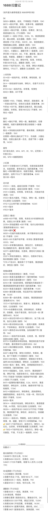

---
tags:
  - 丝袜
  - 裤袜
---

# 连裤袜

## 前言

施工中

## 品牌

### 大牌

| 品牌 | 价格区间 |  主打系列 | 特点 | 备注|
| :---: | :---: | :---: | :---: | :---: |
| [Wolford](#wolford) | 200-500 |  | 除了贵没缺点 | 超贵，买不起 | 
| [绫](#绫) | 25-50 | 天生丝滑 | 网红款。广告打的多，溢价较高，比较贵 |
| [涞觅](#涞觅) | 30-50 | 0.01 | 同绫 | 

### 性价比

| 品牌 | 价格区间 |  主打系列 | 特点 | 备注|
| :---: | :---: | :---: | :---: | :---: |
| [妖怪森林](#妖怪森林) | 10-30 | 超薄 | 平价,性价比不错 |
| [浪莎](#浪莎) |  |  |  | 好像挺便宜的 |
| [月亮上的小女孩](#月亮上的小女孩) | 15-20 | 面膜袜(这是什么?) | 店家是老二刺螈了 | 小红书上看到的，好像不错。款式比较多 |
| [抵达一楼](#抵达一楼) | 1-30 | 过膝袜 | 款式多非常,价格不错 | 小红书上看到的，好像不错。款式比较多 |
| [季小初](#季小初) |   | 美肤袜 | 都是肉色的 |     |
| [SK](#SK) |    |    |    | 绫/涞觅的替代，性价比高 | 
| [珞樱](#珞樱) |    |    |    | 听说是代工厂 |

::: details 低价平替

:::

评价

> 常见大牌 绫、涞觅 的质感确实不错，但都是一次性的，基本在30-50元/条，买多了也吃不消 

> 涞觅和绫这些电商贵在广告上，买了就为天价广告费埋单了，不值。都是找些丝袜厂代工回来再电商公司包装，买杂牌十来块一双性价比会更好，  

::: info 

很多人反应如绫、涞觅等网红牌都是贴牌货 都是一个代工厂出来的 价格高是广告溢价

:::

参考链接：[^3]

## Wolford 

买不起

> 买wolford吧 除了贵没缺点 pure50d超级软 软到瞧不上别的牌子

## 绫

> 观感可以，触感非常好，容易勾丝，档以下还容易破，属于是中看不中用

> 绫主要是手感好丝滑，有自己独特的款式，而且有一股香香的味道

## 涞觅

> 涞觅的巨峰葡萄 简直了 感觉自己就像一颗剥了皮的葡萄

## 妖怪森林

> 妖怪森林的MF11，我给女朋友买过的最好的日常款，便宜，赖穿，手感好，推荐一下。

## 季小初

todo 

## 浪莎

todo

## 抵达一楼

todo

## 月亮上的小女孩

买了条，感觉不错的

## 珞樱

todo

## SK

买了一个好薄啊，一下就坏了

[^1]:https://www.xiaohongshu.com/discovery/item/67dd2513000000001d02fdbd
[^2]:https://bbs.nga.cn/read.php?tid=39864685 
[^3]:https://bbs.nga.cn/read.php?tid=43233361