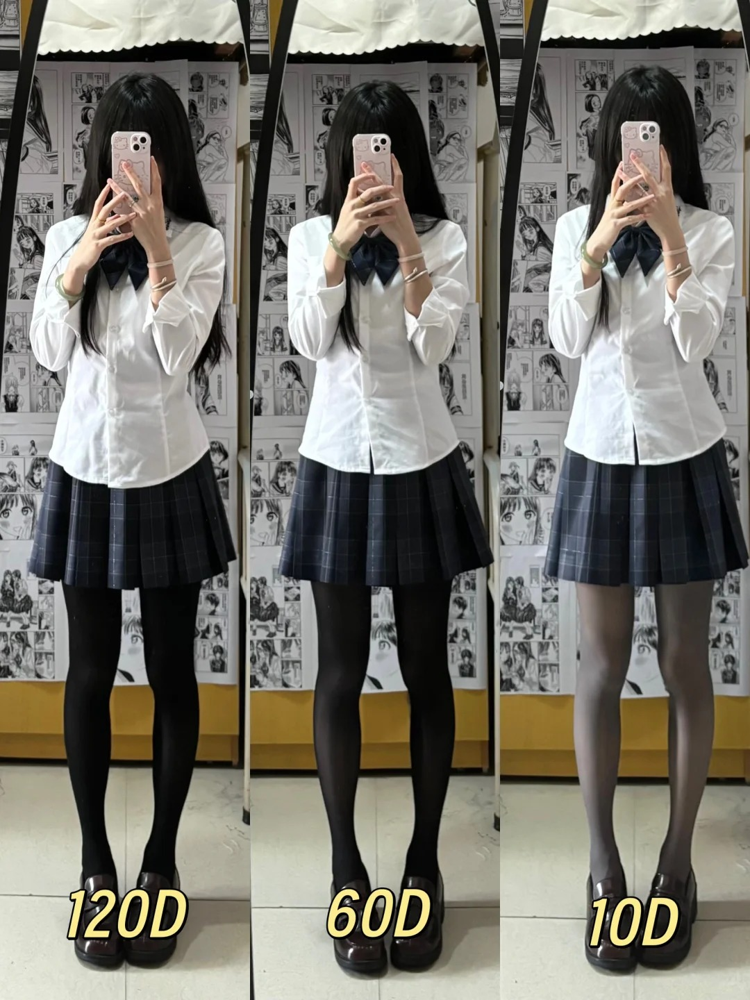
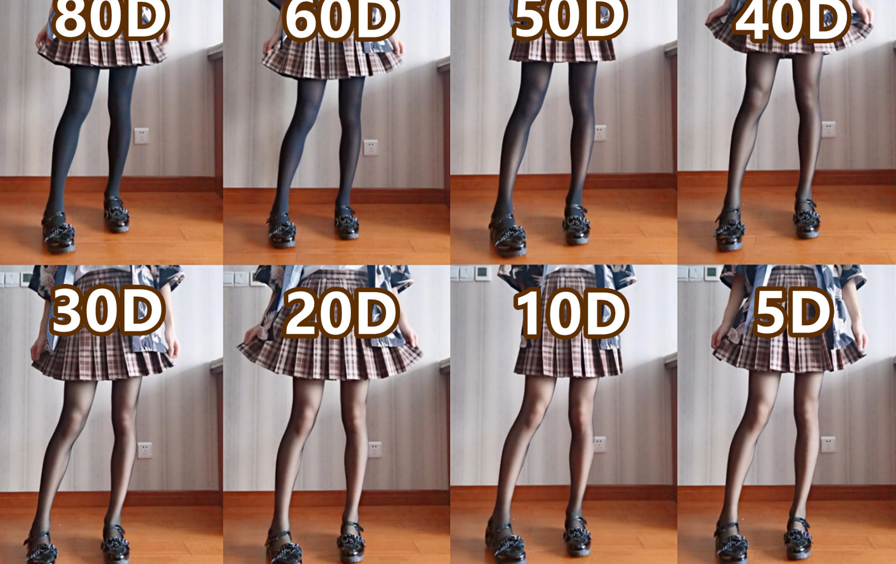
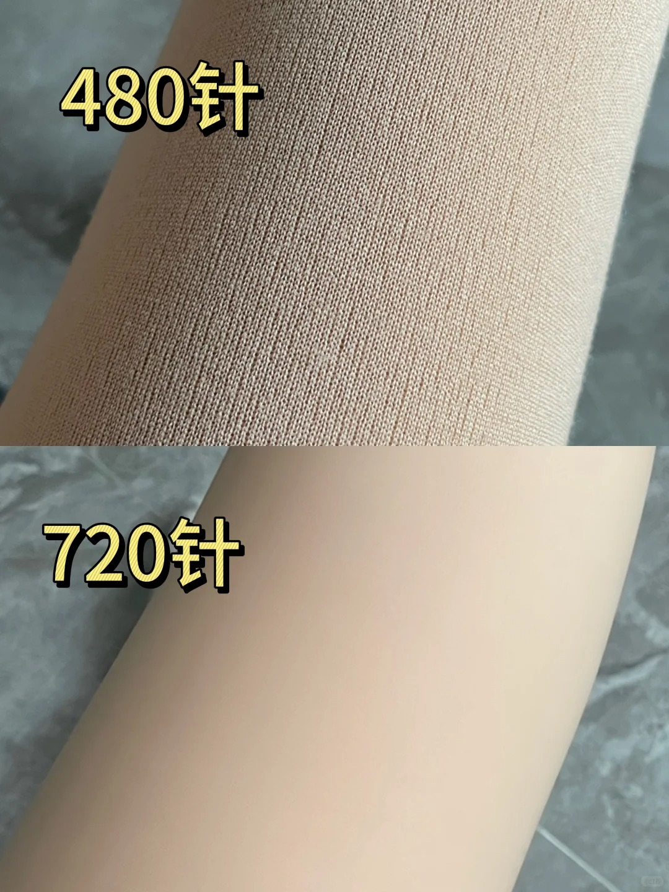
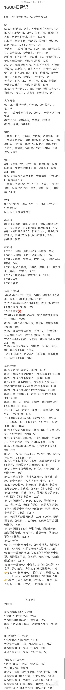

---
tags:
  - 丝袜
  - 裤袜
  - 连丝袜
---

# 连裤袜

## 前言

施工中

## 知识库

了解不同工艺之间的区别。方便自己选择合适的材质，厚度，线数，款式等。

### 材质

- 天鹅绒  
  - 更细跟柔软，延展性也不错，穿起来舒服。常被用来制作高档丝袜！
- 雪黛丽
  - 哑光，薄，弹性好，略贵
- 包芯丝  
  - 通常用来制作中档丝袜, 不耐穿但透肤较好
- 水晶丝
  - 最便宜的种类,使用没有延展性的尼龙丝。穿起来会有点紧绷。

> 丝袜的成分其实都一样，基本就是锦纶和氨纶组成，根据不同配比和织法形成了不同材质特性，氨纶比例越高弹性就越大。

评价 

> 天鹅绒显得臃肿 不透肤 只有春秋才穿 夏季还是包芯丝好看

### 厚度

> 首先需要科普两个单位，D和g，D一般用在丝袜上，g一般用在光腿神器上，单位前的数字越小，袜子越薄。  

> 袜子越薄,就越容易勾丝容易坏  

> 腿型不好看的话，建议可以考虑穿压力袜来修型或者穿厚一点的不那么透的来遮掩一下瑕疵  

[从lo娘角度讲讲丝袜！](https://nga.178.com/read.php?tid=34810643)

::: warning  

5D的超薄款丝袜，哪怕手上有一些干皮，也很容易把丝袜勾的面目全非……这也是很多品牌的超薄丝袜会随产品赠送手套的原因，这种超薄型的丝袜也是超级易消耗品  
基本完整的穿2-3次（完整的一天12小时生活）就会因为各种意外产生勾丝和破损，且价格一般都比厚一点的丝袜要贵。所以建议新手宝多考虑15D到40D的丝袜来作为入门[^1]。

:::

| D数 | 说明 | 适用温度 | 
| --- | --- | --- |
| 0–10D	|超薄“隐形” 款几乎透明 | 25度以上 |
| 10–20D |	轻薄自然	| 20-25度 |
| 20–40D |	透肤但略有| 20度	 |
| 40–80D |	半不透明	| 10度左右 |
| 80–120D |	不透明 | 	5度左右 |
| >120D | 加绒/加厚	|0度以下,严寒冬季  |	

::: details 丝袜厚度上腿对比

:::

::: tip 

0-5D的丝袜基本上都是超薄款了，非常适合夏天穿  
白丝如果厚度太低的情况下跟肉丝区别甚小(30D及以下)

:::

### 款式

> 网袜、吊带、花纹、连裤袜、全身袜；  ...  
> 其中连裤袜有开档、t档、无缝档等..  
> 我感觉无缝档的出现是丝袜选择的一个分水岭，无缝档带来的全包裹感使得丝袜的体验上升了一个台阶，真是伟大的发明!  [^2]

1. 裆型
    - T裆: 顾名思义就是“T”字形裆的丝袜，这种丝袜很百搭,不容易因为运动流汗之类的情况滑落
    - 无缝: 裆部没有缝合线,是一气呵成纺织出来的，穿起来比T型裆更性感。  
2. 腿型
  - TODO

### 针数

丝袜的针数决定了丝滑程度，针数越多纱线相对来说也更细，所以织出来很细腻  
512针以下的不用考虑,效果很差。

## 品牌

| 品牌 | 价格区间 |  主打系列 | 特点 | 备注|
| :---: | :---: | :---: | :---: | :---: |
| [Wolford](#wolford) | 200-500 |  | 除了贵没缺点 | 超贵，买不起 | 
| [绫](#绫) | 25-50 | 天生丝滑 | 网红款。广告打的多，溢价较高，比较贵 |
| [涞觅](#涞觅) | 30-50 | 0.01 | 同绫 | 
| [妖怪森林](#妖怪森林) | 10-30 | 超薄 | 平价,性价比不错 |
| [浪莎](#浪莎) | X | X | X |
| [月亮上的小女孩](#月亮上的小女孩) | X | X | X | 小红书上看到的，好像不错。款式比较多 |
| [季小初](#季小初) | X | 美肤袜 | 都是肉色的 |

::: details 低价平替

| 品牌 | 价格区间 |  主打系列 | 特点 | 备注|
| :---: | :---: | :---: | :---: | :---: |
| [SK](#SK) | X |  | X | X | 绫/涞觅的替代，性价比高 |
| [珞樱](#珞樱) | X |  | X | X | 听说是代工厂 |

:::

评价

> 常见大牌 绫、涞觅 的质感确实不错，但都是一次性的，基本在30-50元/条，买多了也吃不消 

> 涞觅和绫这些电商贵在广告上，买了就为天价广告费埋单了，不值。都是找些丝袜厂代工回来再电商公司包装，买杂牌十来块一双性价比会更好，  

::: info 

很多人反应如绫、涞觅等网红牌都是贴牌货 都是一个代工厂出来的 价格高是广告溢价

:::

参考链接：[^3]

## 绫

> 观感可以，触感非常好，容易勾丝，档以下还容易破，属于是中看不中用

> 绫主要是手感好丝滑，有自己独特的款式，而且有一股香香的味道

## 涞觅

> 涞觅的巨峰葡萄 简直了 感觉自己就像一颗剥了皮的葡萄

## Wolford 

买不起

> 买wolford吧 除了贵没缺点 pure50d超级软 软到瞧不上别的牌子

## 季小初

todo 

## 浪莎

todo

## 妖怪森林

> 妖怪森林的MF11，我给女朋友买过的最好的日常款，便宜，赖穿，手感好，推荐一下。

[^1]:https://www.xiaohongshu.com/discovery/item/67dd2513000000001d02fdbd
[^2]:https://bbs.nga.cn/read.php?tid=39864685 
[^3]:https://bbs.nga.cn/read.php?tid=43233361