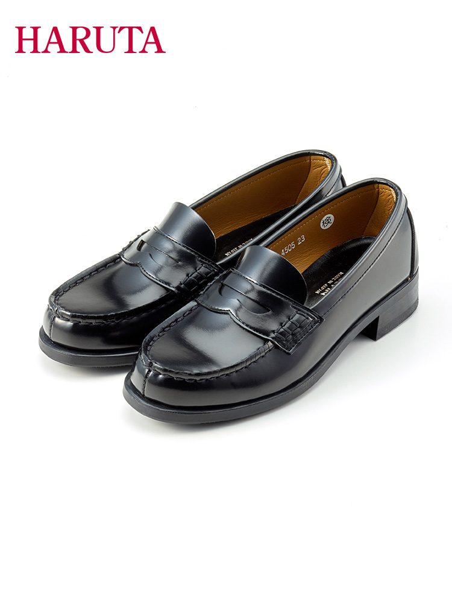
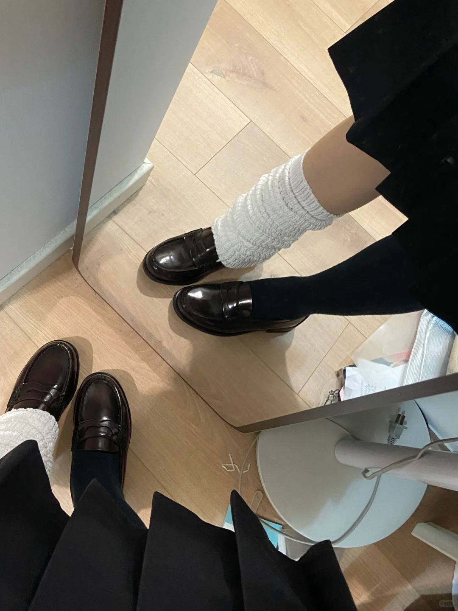
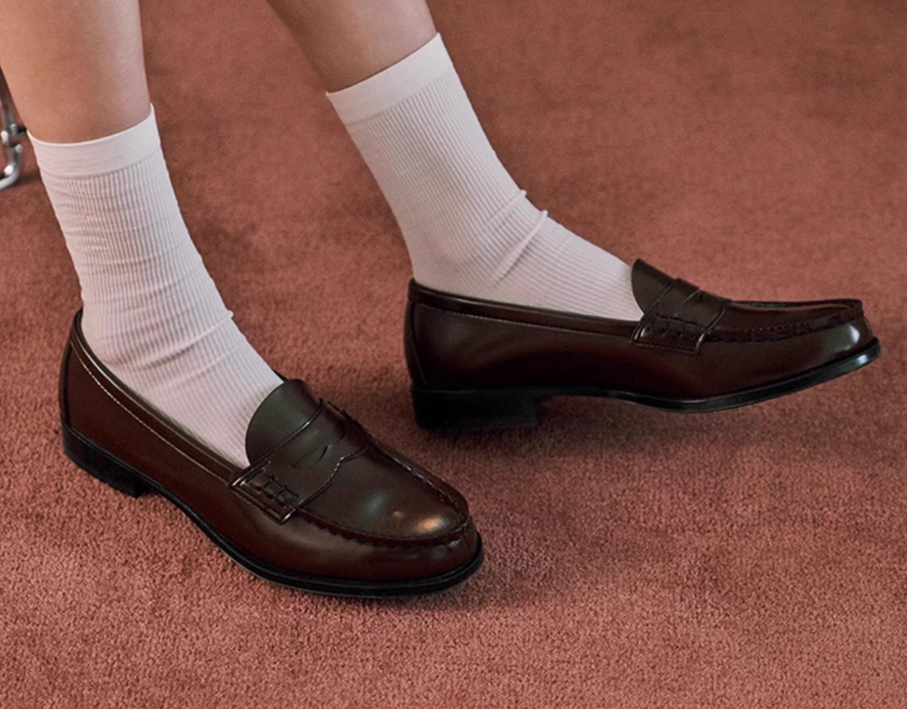
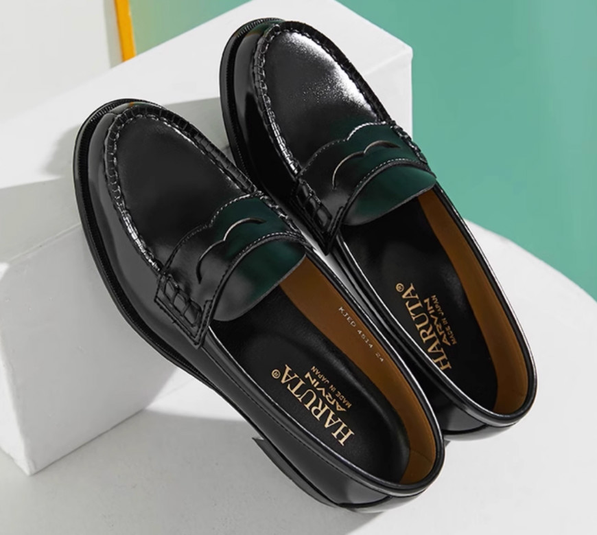
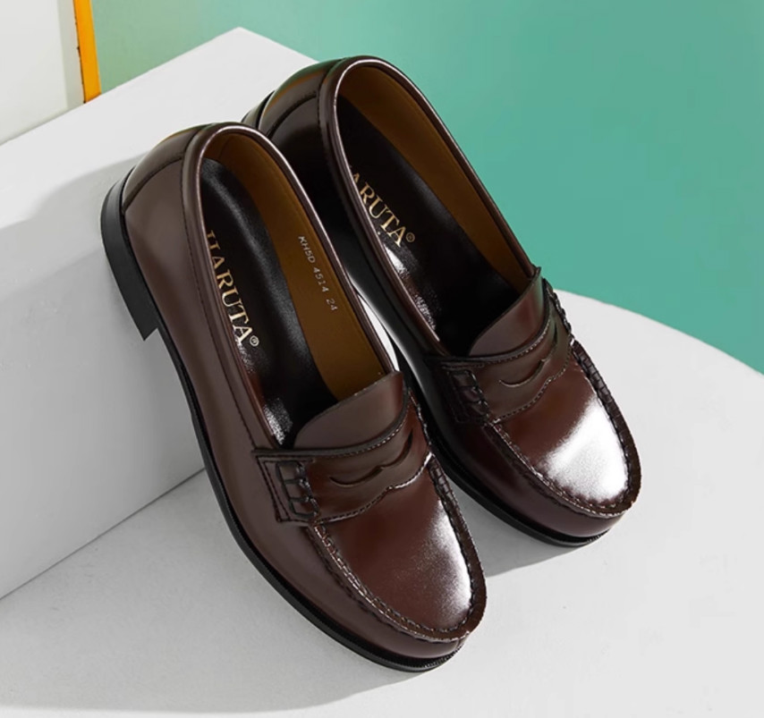
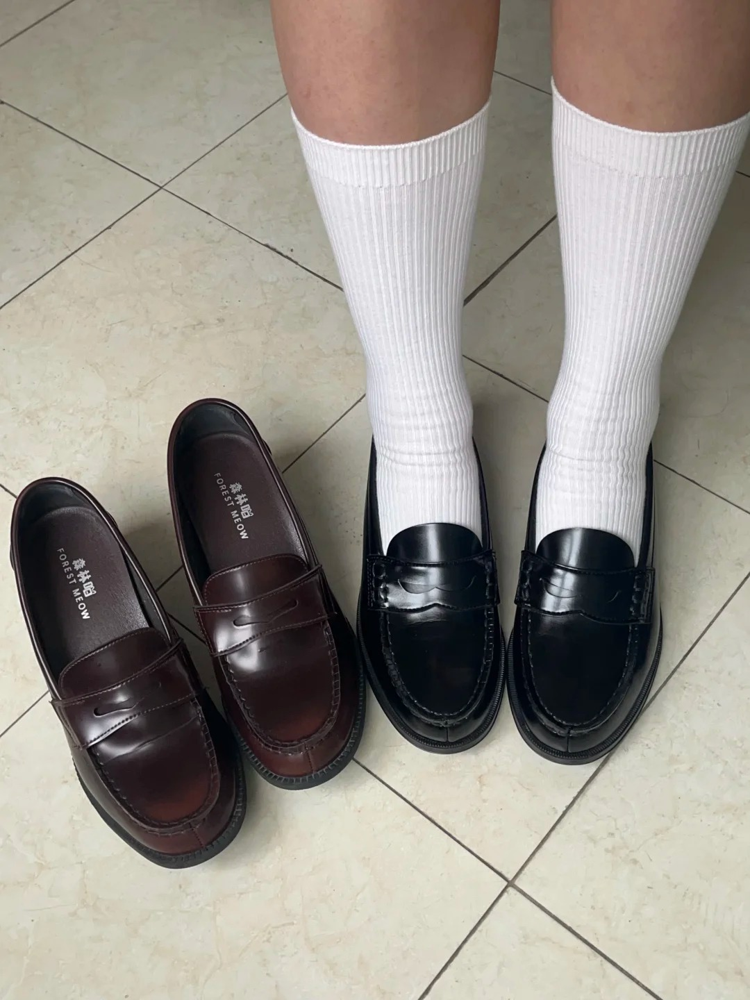
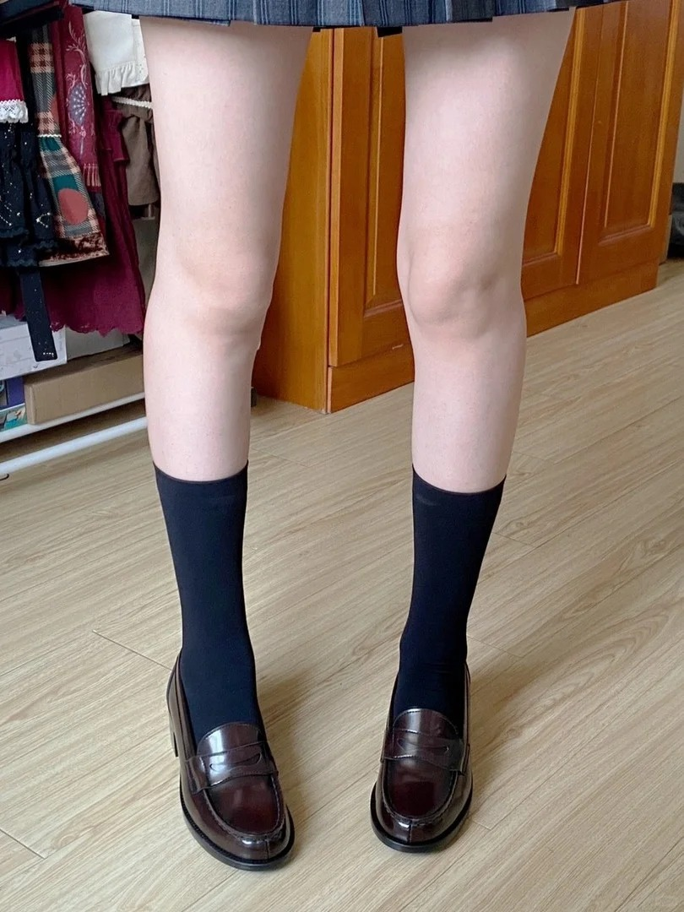
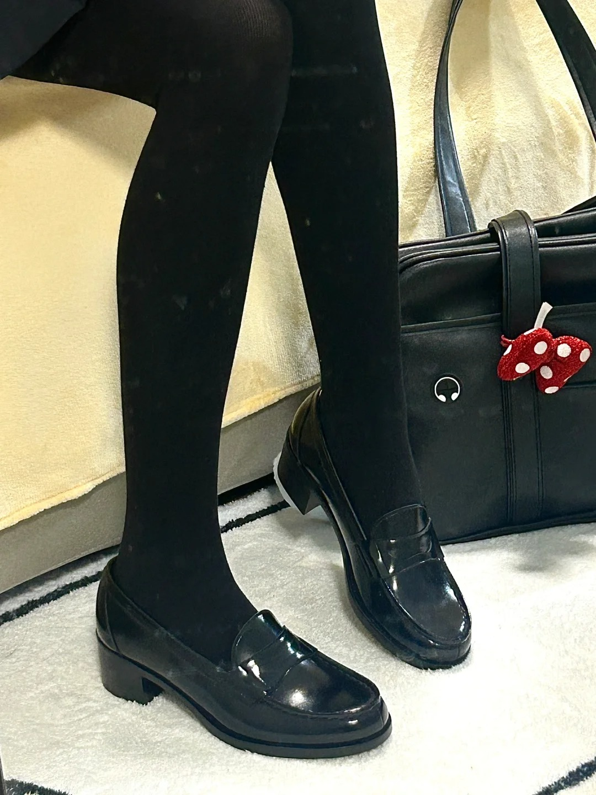
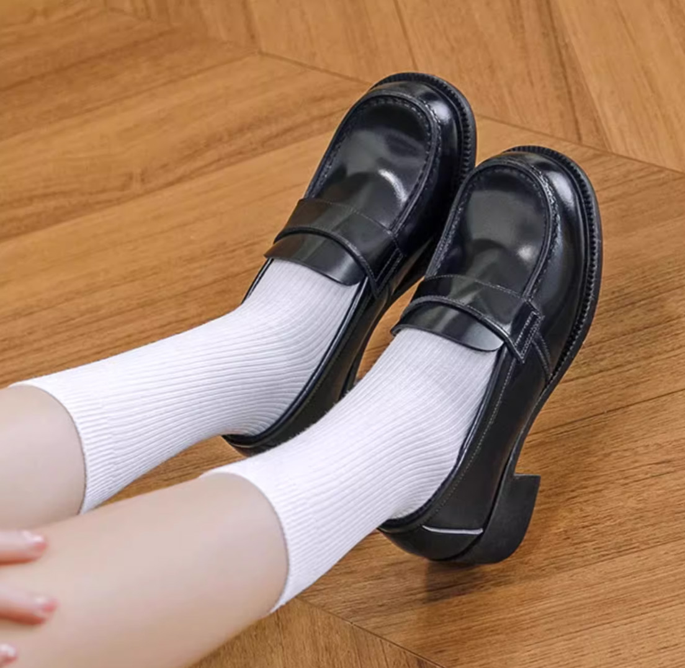

---
tags:
  - 鞋子
  - haruta
  - 鞋子/制服鞋
  - 衣服/鞋子
---

# 制服鞋

##  前言

这种鞋真的非常好看，优雅。人类最伟大的发明！  
不管是配JK还是洛丽塔或者是日常穿着都非常的休闲非常的可爱，很有少女的感觉。

一些攻略
[Haruta制服鞋怎样穿更舒适小tips分享～](https://www.bilibili.com/video/BV17g4y1G7hN/)
[haruta的爆款鞋型怎么选？](https://www.xiaohongshu.com/discovery/item/67ff8368000000001c01136c)

::: tip 注意

鞋子舒适度因人而异，所有的评价仅供参考，请以实物为准。
:::

## Haruta

### 介绍

制服鞋这个分类里永远滴神！无论版型还是做工都是顶级。

一些评价

> 总体来说他们家的鞋，如果是胖脚的话，可能就要选大一号，如果脚比较瘦的话，可能就要小一号。具体还要看你的情况来选择。
> 买haruta之前先考虑好能不能接受鞋硬 穿的会累 但也很神奇 能暴走几万步都不会难受 后面越穿越舒服

好像大部分是建议可以选大一码，大了可以用后跟帖。小了就磨脚了。

| 型号 | 版型 | 跟高 | 鞋宽 | 材质 | 颜色 | 参考价 | 备注 |
| :---: | :---: | :---: | :---: | :---: | :---: | :---: | :---: |
| [4505](#haruta-4505) | 尖头 | 3CM | 3E | 人造皮 | 黑色/棕色 | ¥400 | 穿着舒适,好走。另有升级版45050 |
| [4514](#haruta-4514) | 尖头 | 2.5CM | 2E | 人造皮 | 黑色/棕色/酒红色 | ¥330 | 脚宽的不建议，会很挤脚压脚背 |
| [4603](#haruta-4603) | 尖头 | 4.5CM | 3E | 人造皮 | 黑色/棕色 | ¥403 | 有真皮版 463 |
| [4710](#haruta-4710) | 方头 | 5CM | 3E | 人造皮 | 黑色/棕色 | ¥420 | 有真皮版 575 |
| [4711](#haruta-4711) | 方头 | 5CM | 3E | 造皮 | 黑色/棕色 | ¥400 | 有真皮版 576 |
| [4900](#haruta-4900) | 方头 | 4.5CM | 3E | 人造皮 | 黑色/棕色 | ¥400 | 有真皮版 390 |

- 真皮材质
  - 质感完全不一样 不容易起褶子
- 人造皮
  - 更亮，容易起褶皱。

### Haruta 4505

评价

> 4505是三双里最舒适的尖头鞋  
> 这个鞋型我极力推荐！尖头的很校供而且舒适度也好。尖头部分我穿着位置够一点不挤  
> 穿上会非常紧,脚背和脚后跟都非常挤,穿的时间长了会稍微松一点点,鞋子超级硬。  

::: details 查看更多

:::

### Haruta 4514

评价 

> 脚宽的不建议，会很挤脚压脚背  
> 这个鞋型听说是很接近樱花妹穿的，也是尖头的很校供很优雅，但尖头位置比4505窄些是2E的  
> 4514瘦脚刚开始穿很舒服走路走多了就开始受不了了但是真的美  

::: tip 
感觉比较适合瘦脚
:::

::: details 查看更多

:::
### Haruta 4603

评价

> 这个鞋型我愿称之为美丽的铁板刑具😭尖头➕跟高5cm➕硬底 buff叠满了  
> 是3e的 我个人是真觉得挺舒服的 每天穿着通勤甚至跑步的  
> 4603千万不要…这个掉跟的鞋让我落下了“终身的残疾” 
> 巨美无比，根不高还显腿长腿细，我觉得分人，我每天都穿也不累脚  

::: details 查看更多

:::

### Haruta 4710

4710和4711只有鞋面上的装饰不一样，其他都是一模一样的。被称为4900的中跟版

评价

> 合适穿一些比较可爱一点的jk穿搭   
> 个人觉得不算很百搭的一款 买了两个颜色甚至有点后悔  

::: details 查看更多

:::

### Haruta 4711

4710和4711只有鞋面上的装饰不一样，其他都是一模一样的
金属装饰扣不可拆卸。

评价

> 我第一眼觉得它长得像4900 很好走 不会累 带跟的 显的腿很长很纤细

::: details 查看更多

:::

### Haruta 4900

评价

> 这个鞋型是我认为最舒服的，方头的不挤脚也适合搭配一些可爱的衣服  
> 版型无敌！不能平替！黑色棕色随便入都百搭

::: details 查看更多

试穿图

:::

## 雾羽

## 森林喵

评价

> 森林喵特别好穿，去迪士尼走两万多步不磨脚  
> 森林喵舒而适之，haruta 有而型之

