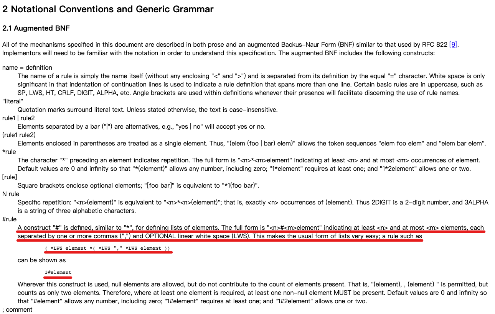

---
tags:
  - 网络/协议/HTTP
  - 网络/协议/HTTP/Header
---
# 同一个 Header 键的多个值应该如何按照规范处理？

##### 文档版本

| 编辑者 | 版本 | 变更日期 | 变更说明 |
| ----- | --- | ------- | ------- |
| Neko | v1.0.0 | 2022-05-30 | 创建 |

曾经想过这个问题，但是似乎自己没有遇到过类似的情况所以没深究，今天在 Mi Home 群和 Rikumi 讨论「同一个 Header 键的多个值应该如何发送和接收」的时候好奇就去查了一下。

是在这篇文章看到讲解：[Are Duplicate HTTP Response Headers acceptable? (重复的 HTTP 响应标头值应该是可被接受的吗？) - Stack Overflow](https://stackoverflow.com/questions/4371328/are-duplicate-http-response-headers-acceptable)
讲解中提到了一个案例 [RFC2616 Header Field Definitions (标头字段定义)](https://www.w3.org/Protocols/rfc2616/rfc2616-sec14.html#sec14.9)，在这篇 RFC 针对 Cache-Control 相关的标头定义中提到了类似的「层级」：


顺藤摸瓜找到 RFC2616 的第二部分：[Notational Conventions and Generic Grammar (符号约定和通用语法)](https://www.w3.org/Protocols/rfc2616/rfc2616-sec2.html#sec2) 可以看到对上面提到的 `1#cache-directive` 层级的说明。



根据 RFC2616 第二部分的定义，任何 `#` 字符开头的字段结构都应该是一个列表，「每一个元素之间应该使用一个或是多个英文逗号 `,` 和**可选**的线性空格（LWS）进行连接」。

我们可以因此解读以下报文：

```
Cache-Control: no-cache
Cache-Control: no-store
```

为下面的形式：

```
Cache-Control: no-cache, no-store
```

再根据 [RFC7230 Hypertext Transfer Protocol (HTTP/1.1): Message Syntax and Routing (超文本传输协议 (HTTP/1.1): 消息语法和路由)](https://datatracker.ietf.org/doc/html/rfc7230#section-3.2.2) 中 [3.2.2](https://datatracker.ietf.org/doc/html/rfc7230#section-3.2.2).  Field Order 字段顺序) 章节更详细的定义：

>  A recipient MAY combine multiple header fields with the same field
   name into one "field-name: field-value" pair, without changing the
   semantics of the message, by appending each subsequent field value to
   the combined field value in order, separated by a comma.  The order
   in which header fields with the same field name are received is
   therefore significant to the interpretation of the combined field
   value; a proxy MUST NOT change the order of these field values when
   forwarding a message.

翻译过来的话就是说：收件方可以将具有相同字段名的多个标头字段合并为一个 `"field-name: field-value"` 对，而不改变信息的语义。这个方法是将每个随后的标头字段值依次附加到后面的字段值依次追加到合并的字段值中，用逗号隔开。顺序是接收具有相同字段名的标题字段的顺序。因此，接收具有相同字段名的头字段的顺序对解释组合字段值很重要。代理在转发消息时不得改变这些字段值的顺序。转发消息时，代理不得改变这些字段值的顺序。

所以正确的做法是 **对同一个 Header 键的多个值使用英文逗号进行间隔并按照传输顺序拼接在一起**。
