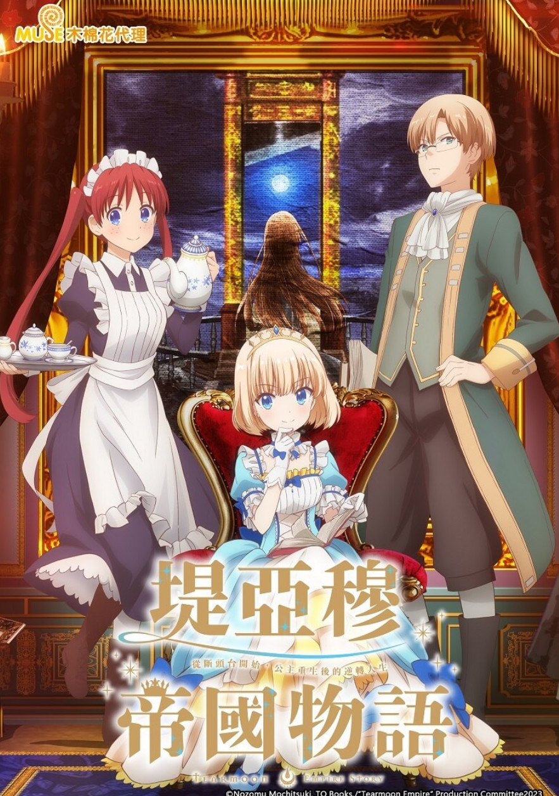
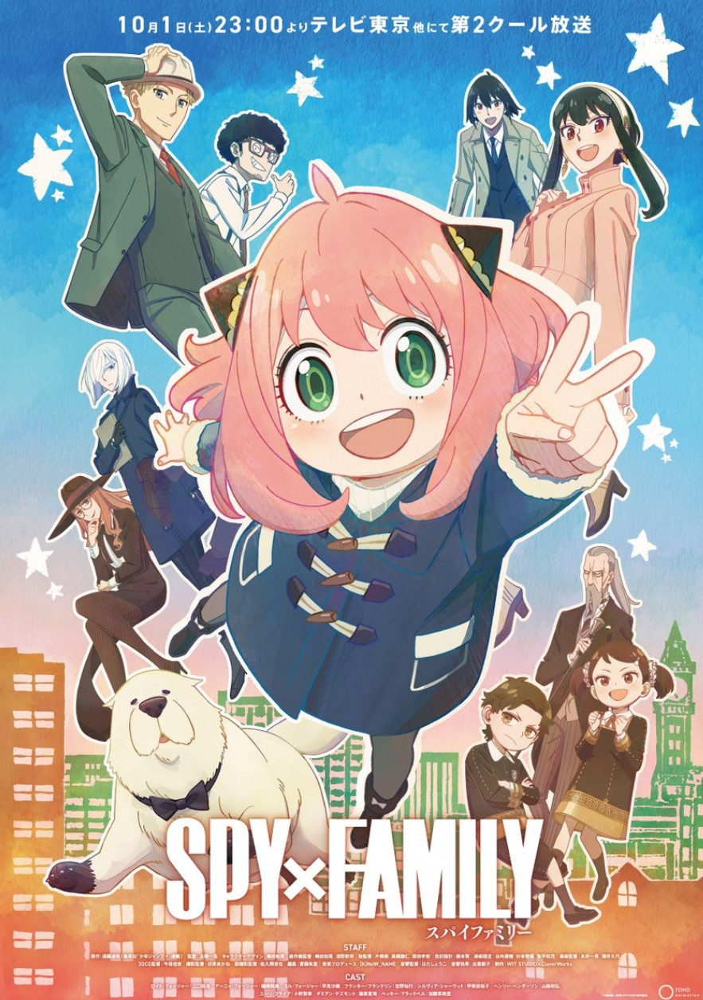

---
tags:
  - 动画
  - 动漫
  - AGC
  - ACG/动漫
  - ACG/动画
---

# 动画

从今日起记录看过的动画！

## 2023

### 猪肝记得煮熟再吃

<Gallery title="猪肝记得煮熟再吃" creator="逆井卓馬" href="https://ani.gamer.com.tw/animeVideo.php?sn=35484" linkText="前往观看">
  <template #image>
    
  </template>
   <template #describe>
轉生成豬的理科宅男在異世界與美少女打情罵俏（!?）的奇幻故事  
我是個生吃豬肝後昏迷過去的不起眼阿宅。  
才以為自己轉生到了異世界，卻只是變成一隻豬！  
我躺在豬圈，拯救了我的是據說能看透人心的少女潔絲。  
嚄嚄！好可愛！從豬的角度來看，就能從裙襬窺見純白的……
   </template>
</Gallery>

洁丝颜值担当，对后续剧情很有兴趣。有时间会去补小说！

### 堤亞穆帝國物語～從斷頭台開始，公主重生後的逆轉人生～

<Gallery title="堤亞穆帝國物語～從斷頭台開始，公主重生後的逆轉人生～" creator="餅月望" href="https://ani.gamer.com.tw/animeVideo.php?sn=35475" linkText="前往观看">
  <template #image>
    
  </template>
   <template #describe>
头，还在，我变小了。在发生革命后数年的堤亚穆帝国，被蔑称为任性皇女的米雅被革命军推上了断头台处决……本应该被处死，醒来以后却发现自己变回了12岁的样子！看来这里是重新来过的世界――她的枕边放着的是处刑前自己所写的染血的日记。  
走上了第二人生的米雅，决定复兴帝国。是为了拯救百姓于饥饿之中？还是为了那些在内战中牺牲的士兵？都不是，自身也是为了躲避被送上断头台的命运！！  
这，这种事情很简单的！任性公主的行动居然引发了奇迹，改变历史的奇幻故事即将开始——
   </template>
</Gallery>

迪化巅峰笑点很多，还有漫画，不亏是帝国的H！

## 2022年

### SPY x FAMILY 間諜家家酒

<Gallery title="SPY x FAMILY 間諜家家酒" creator="遠藤達哉" href="https://ani.gamer.com.tw/animeVideo.php?sn=28798" linkText="前往观看">
  <template #image>
    
  </template>
   <template #describe>
每一個人都擁有不想讓任何人看見得自己的一面―― 位在世界各國於檯面下進行激烈情報戰的時代。東國與西國已經維持了數十年的冷戰狀態。所屬西國情報局對東課 WISE 厲害的間諜〈黃昏〉，為了前往找尋被譽為是會威脅到東西國和平的危險人物，東國的國家統一黨總裁 唐納文・戴斯蒙德 所正在籌備的戰爭計畫，被賦予了一項極秘任務。其名稱為 Operation〈梟〉。內容講述「在一週內組建家庭，並潛入戴斯蒙德兒子所就讀的學校吧」。但是，他所遇到的「女兒」是會讀心的超能力者、「妻子」則是暗殺者！為了互相的利益而成為家庭，決定在隱藏真實身分的情況下共同生活的 3 人。世界的和平就託付即將發生一系列事件的暫定的家庭…？
   </template>
</Gallery>

热门程度无需多说，非常值得一看！

### 女友成双 

<Gallery title="女友成双 " creator="ヒロユキ" href="https://ani.gamer.com.tw/animeVideo.php?sn=23381" linkText="前往观看">
  <template #image>
    
  </template>
  <template #describe>
主人公向井直也，是一名高中一年级学生。在向一直很喜欢的佐木咲告白以后，顺利让她成为了女朋友。如今正处于幸福的顶端。   
但是，此时美少女水濑渚向直也搭话。突然间渚对直也告白，希望能和他交往。 
因渚的好人性格而心生动摇的直也，做出了某个决定 
从令人意外的选择开始，新基准的恋爱喜剧。
  </template> 
</Gallery>

真没想到这玩意还能有第二季
