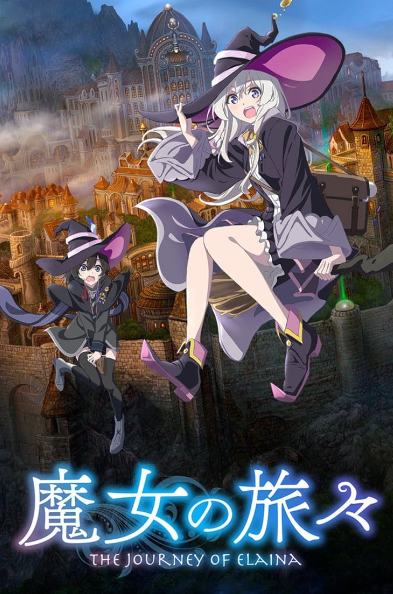
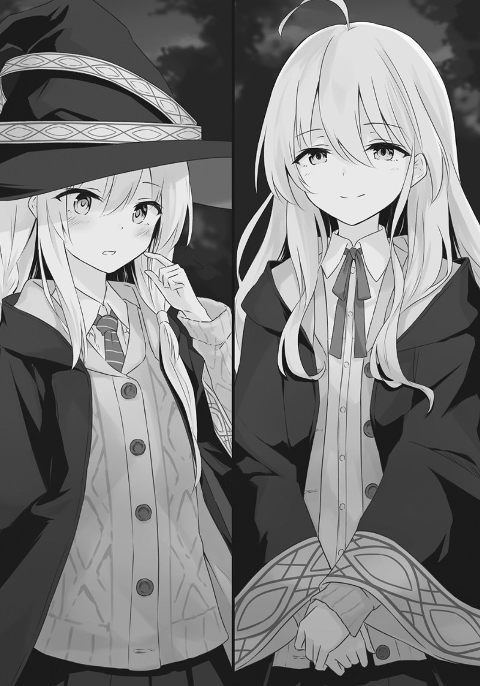

# 动画

从今日起记录看过的动画！

## 2023

### 猪肝记得煮熟再吃

<Gallery title="猪肝记得煮熟再吃" creator="逆井卓馬" href="https://ani.gamer.com.tw/animeVideo.php?sn=35484" linkText="前往观看">
  <template #image>
    
  </template>
   <template #describe>
转生成猪的理科宅男在异世界与美少女打情骂俏（!?）的奇幻故事   
我是个生吃猪肝后昏迷过去的不起眼阿宅。  
才以为自己转生到了异世界，却只是变成一只猪！  
我躺在猪圈，拯救了我的是据说能看透人心的少女洁丝。  
嚄嚄！好可爱！从猪的角度来看，就能从裙摆窥见纯白的……  
   </template>
</Gallery>

洁丝颜值担当，对后续剧情很有兴趣。有时间会去补小说！

### 堤亞穆帝國物語～從斷頭台開始，公主重生後的逆轉人生～

<Gallery title="堤亞穆帝國物語～從斷頭台開始，公主重生後的逆轉人生～" creator="餅月望" href="https://ani.gamer.com.tw/animeVideo.php?sn=35475" linkText="前往观看">
  <template #image>
    
  </template>
   <template #describe>
头，还在，我变小了。在发生革命后数年的堤亚穆帝国，被蔑称为任性皇女的米雅被革命军推上了断头台处决……本应该被处死，醒来以后却发现自己变回了12岁的样子！看来这里是重新来过的世界――她的枕边放着的是处刑前自己所写的染血的日记。
走上了第二人生的米雅，决定复兴帝国。是为了拯救百姓于饥饿之中？还是为了那些在内战中牺牲的士兵？都不是，自身也是为了躲避被送上断头台的命运！！
这，这种事情很简单的！任性公主的行动居然引发了奇迹，改变历史的奇幻故事即将开始——
   </template>
</Gallery>

迪化巅峰笑点很多，还有漫画，不亏是帝国的H！

## 2022年

### SPY x FAMILY 間諜家家酒

<Gallery title="SPY x FAMILY 間諜家家酒" creator="遠藤達哉" href="https://ani.gamer.com.tw/animeVideo.php?sn=28798" linkText="前往观看">
  <template #image>
    
  </template>
   <template #describe>
每一个人都拥有不想让任何人看见得自己的一面―― 位在世界各国于台面下进行激烈情报战的时代。东国与西国已经维持了数十年的冷战状态。所属西国情报局对东课WISE 厉害的间谍〈黄昏〉，为了前往找寻被誉为是会威胁到东西国和平的危险人物，东国的国家统一党总裁唐纳文・戴斯蒙德所正在筹备的战争计画，被赋予了一项极秘任务。
其名称为 Operation〈枭〉。内容讲述「在一周内组建家庭，并潜入戴斯蒙德儿子所就读的学校吧」。但是，他所遇到的「女儿」是会读心的超能力者、「妻子」则是暗杀者！为了互相的利益而成为家庭，决定在隐藏真实身分的情况下共同生活的 3 人。世界的和平就托付即将发生一系列事件的暂定的家庭…？
   </template>
</Gallery>

热门程度无需多说，非常值得一看！

### 更衣人偶坠入爱河

<Gallery title="更衣人偶坠入爱河" creator="福田晋一" href="https://ani.gamer.com.tw/animeVideo.php?sn=27366" linkText="前往观看">
  <template #image>
    
  </template>
  <template #describe>
制作着女儿节娃娃，以成为娃娃工匠为目标的男高中生五条新菜。
他专心一志地制作女儿娃娃，却也因此疏离的同世代的流行，迟迟无法融入班级。
对这样的新菜来说，总是身处班上团体的中心，大受欢迎的喜多川海梦就像是不同世界的人一样。
但就在某天，以意想不到的事情为契机，与海梦拥有了共同的秘密。
原以为两人绝对不会有交集的世界开始转动了起来。
  </template> 
</Gallery>

第二季也快点端上来啪，另有漫画也在追更！

### 女友成双 

<Gallery title="女友成双 " creator="ヒロユキ" href="https://ani.gamer.com.tw/animeVideo.php?sn=23381" linkText="前往观看">
  <template #image>
    
  </template>
  <template #describe>
主人公向井直也，是一名高中一年级学生。在向一直很喜欢的佐木咲告白以后，顺利让她成为了女朋友。如今正处于幸福的顶端。 
但是，此时美少女水濑渚向直也搭话。突然间渚对直也告白，希望能和他交往。
因渚的好人性格而心生动摇的直也，做出了某个决定
从令人意外的选择开始，新基准的恋爱喜剧。
  </template> 
</Gallery>

真没想到这玩意还能有第二季

## 2020年

### 魔女之旅
<Gallery title="魔女之旅 " creator="白石定規" href="https://ani.gamer.com.tw/animeVideo.php?sn=18427" linkText="前往观看">
  <template #image>
    
  </template>
  <template #describe>
在某个地方有一位旅人。她的名字叫伊蕾娜。
她是年纪轻轻就成为了最上位的“魔女”的才女。
憧憬着小时候读过的旅行的故事，
顺其自然地持续着随心所欲的长途旅行。
在广大的世界里自由地穿行 ，遇见莫名其妙、可笑的人，
或是见证到某人的美丽的日常，
她作为旅人，也没有什么目的，
重复着和各种各样的国家和人的相遇。
以及相同数量的——

“请别管我。我就是个旅人，
必须赶路了。”
  </template> 
</Gallery>

第一部为了支持原作买了书籍，也是反复重播次数最多的动画！一百混！    
另外碟片明明卖的不错, 各种周边也是出个不停, 第二季怎么**还 不 出**, 想看到会动的扫帚小姐, 我永远喜欢扫帚小姐

