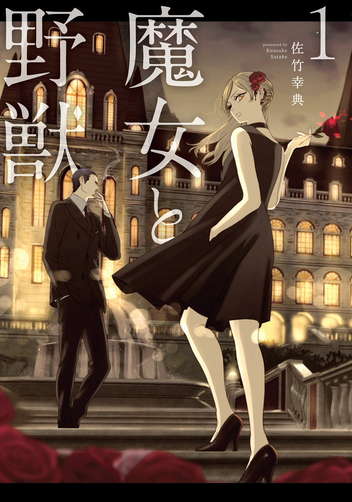
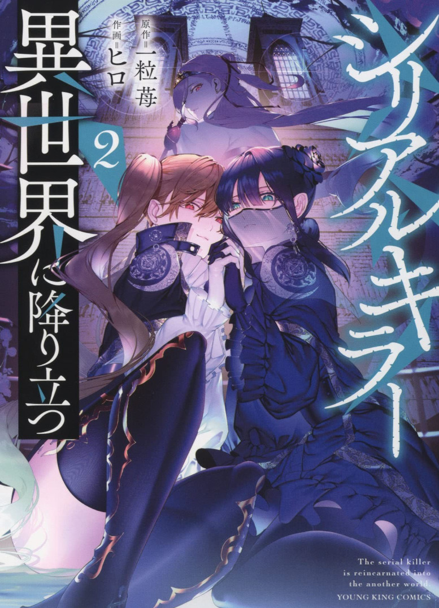
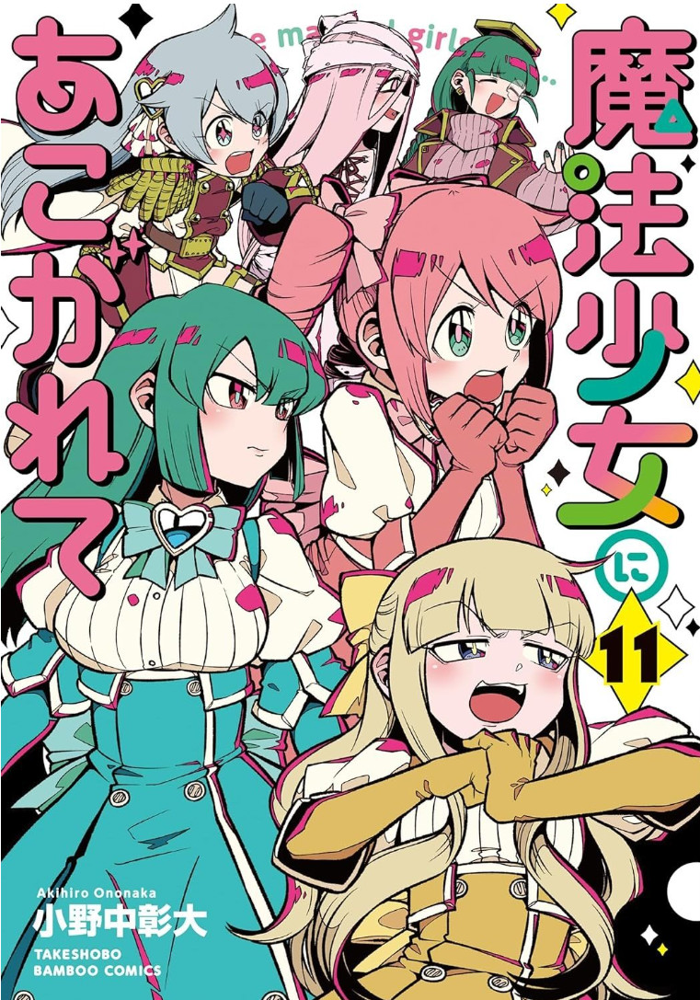

---
tags:
  - 漫画
  - AGC
  - ACG/漫画
---

# 漫画

太多看过的没完结的就慢慢忘记了，在此处记录一下想继续追读的~

## 2023年

### 魔女与野兽

<Gallery title="魔女与野兽" creator="佐竹幸典" href="https://magazine.yanmaga.jp/c/majyotoyajyu/" linkText="前往官网">
  <template #image>
    
  </template>
   <template #describe>
   「起源魔女」總共有17人。乘載著所有力量的人在現代也遍布世界各地。其中一位背負著棺材的男人與一位雙眼有如野獸的少女在此現身。這位少女曾經被魔女詛咒，為了解開詛咒而尋找著某位魔女。 
   在這兩人前出現的魔女是他們尋找的獵物嗎？而解開詛咒的方法又是什麼呢？ 
   這是一場追逐邪惡的復仇劇，他們追尋的獵物唯有「魔女」而已。當邪惡的「魔女」碰上飢餓的「野獸」，故事將迎來重大轉折，並開始華麗又激烈的戰鬥。一個華麗而殘酷的黑暗奇幻故事在此拉開序幕！
   </template>
</Gallery>

奇迹暖暖基德,画风超级赞。作者因病已休刊一年。期待恢复更新啊啊啊啊！

2024年已经动画化咯，虽然制作有些贫穷~

### 连环杀手降临异世界

<Gallery title="连环杀手降临异世界" creator="一粒苺" href="https://piccoma.com/web/product/107256?etype=episode" linkText="免费阅读">
  <template #image>
    
  </template>
   <template #describe>
想停止杀人却停不下杀人的冲动，这位杀人狂如他所愿被处以死刑。 
但他还来不及欣喜，就被转生到了异世界。女神交给他的使命是，活用他的杀人冲动，将12位前人转生者全部杀死！ 
转生者未必是圣人！异世界转生悬疑剧开幕！
   </template>
</Gallery>

## 2022年

### 处刑少女的生存之道

<Gallery title="处刑少女的生存之道" creator="三ツ谷亮" href="https://www.ganganonline.com/title/1522" linkText="漫画官网">
  <template #image> 
    
  </template>
  <template #describe>
曾从日本来访，给世界带来巨大灾害的“迷途之人”。 
因为他们过去带来了毁灭世界的灾难，所以被视为“禁忌指定”，有必要暗中处刑。 
以处刑“迷途之人”为业的“处刑人”梅诺，有一天遇到了日本少女灯里。 
梅诺像往常一样打算完成任务，但因为灯里的“某种能力”而以失败告终。 
为了确实地处刑灯里，梅诺带着她，向着能够消灭任何异世界人的仪式场地的大教堂进发。
  </template>
</Gallery>

还是想看到结局的，希望漫画不会被腰斩。另外动画OP很好听

### 憧憬成为魔法少女

<Gallery title="憧憬成为魔法少女" creator="小野中彰大" href="https://storia.takeshobo.co.jp/manga/mahoako/" linkText="前往官网">
  <template #image> 
    
  </template>
   <template #describe>
   原本期望能成为魔法少女的女主柊舞缇娜，某天突然遇到像吉祥物的生物，却获得能变成邪恶组织女干部的能力，并与原本憧憬的魔法少女们对抗。
   </template>
</Gallery>

非常色的漫画，使我……

### 魔都精兵的奴隶

<Gallery title="魔都精兵的奴隶" creator="竹村洋平" href="https://shonenjumpplus.com/episode/10834108156641784254" linkText="前往官网">
  <template #image>
    
  </template>
  <template #describe>
制作着女儿节娃娃，以成为娃娃工匠为目标的男高中生五条新菜。 
他专心一志地制作女儿娃娃，却也因此疏离的同世代的流行，迟迟无法融入班级。 
对这样的新菜来说，总是身处班上团体的中心，大受欢迎的喜多川海梦就像是不同世界的人一样。 
但就在某天，以意想不到的事情为契机，与海梦拥有了共同的秘密。 
原以为两人绝对不会有交集的世界开始转动了起来。
  </template> 
</Gallery>

此外作者的画工非常赞, 喜欢看恋狗狗吃瘪的样子  
2024年动画播出了，目前看了两集观感不错，画面也没有像PV一样那么油腻。

### 更衣人偶坠入爱河

<Gallery title="更衣人偶坠入爱河" creator="福田晋一" href="https://magazine.jp.square-enix.com/yg/introduction/sonobisque/" linkText="前往官网">
  <template #image>
    
  </template>
  <template #describe>
制作着女儿节娃娃，以成为娃娃工匠为目标的男高中生五条新菜。 
他专心一志地制作女儿娃娃，却也因此疏离的同世代的流行，迟迟无法融入班级。 
对这样的新菜来说，总是身处班上团体的中心，大受欢迎的喜多川海梦就像是不同世界的人一样。 
但就在某天，以意想不到的事情为契机，与海梦拥有了共同的秘密。 
原以为两人绝对不会有交集的世界开始转动了起来。
  </template> 
</Gallery>

现在是幻想时间，还有就是什么时候推推主线啊  
